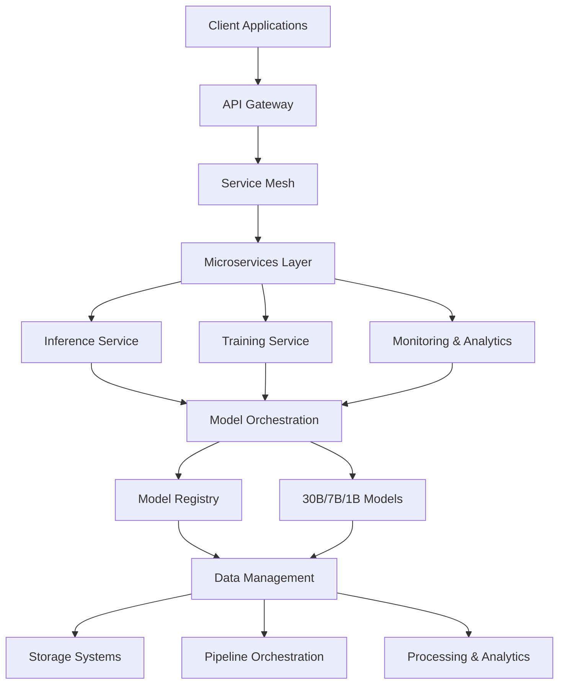
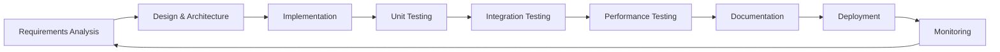
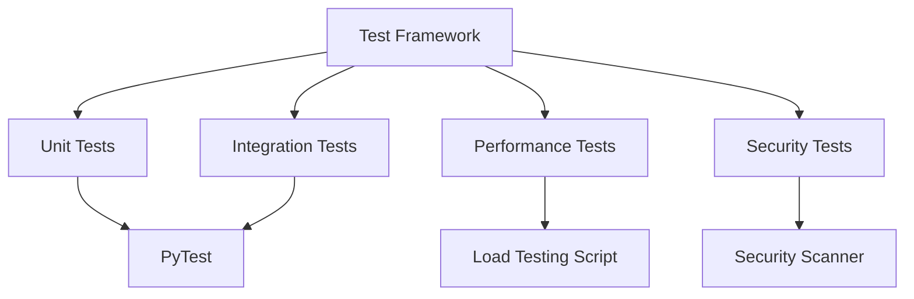
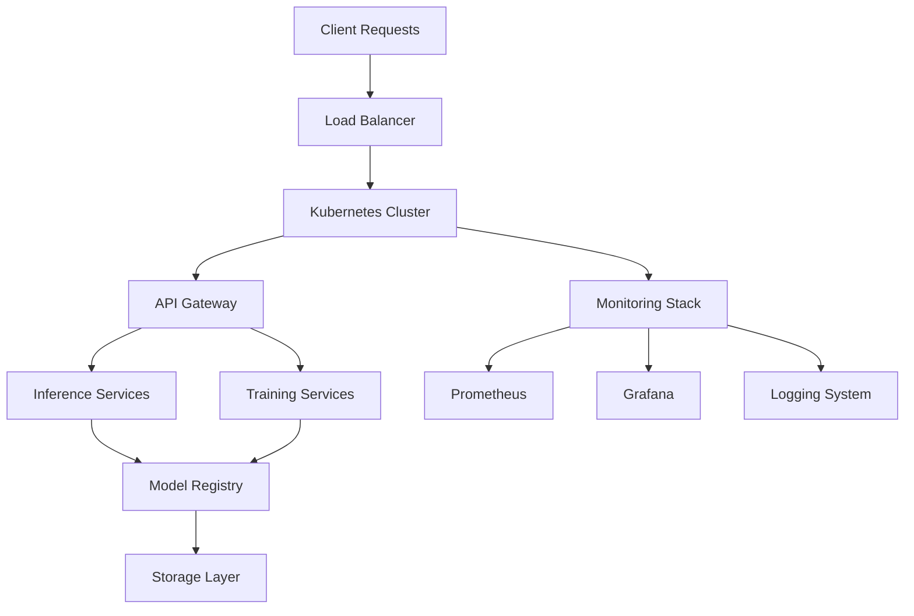
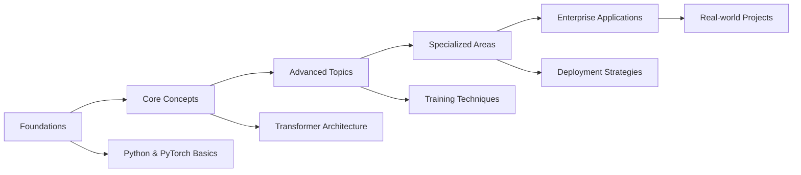

# Large Language Model DEMO

## Abstract

The Large Language Model DEMO is an advanced educational and enterprise-grade framework designed to provide comprehensive learning materials and reference implementations for building, training, and deploying large-scale language models. This project demonstrates state-of-the-art Transformer architectures with next-generation AI capabilities including Multi-Modal Adaptive Attention, Spiking Neural Networks, Causal Reasoning, Ethical Constraints, and Advanced Memory Systems. With a complexity of 30 billion parameters, the system showcases cutting-edge concepts while maintaining a professional structure suitable for both educational purposes and enterprise-level applications.

---

## Table of Contents

1. [Abstract](#abstract)
2. [System Overview](#system-overview)
3. [Architecture](#architecture)
4. [Key Features](#key-features)
5. [Technology Stack](#technology-stack)
6. [Project Structure](#project-structure)
7. [Development Workflow](#development-workflow)
8. [Testing Framework](#testing-framework)
9. [Deployment Architecture](#deployment-architecture)
10. [Educational Components](#educational-components)
11. [Installation & Setup](#installation--setup)
12. [Usage Guide](#usage-guide)
13. [Performance Optimization](#performance-optimization)
14. [Recent Enhancements](#recent-enhancements)
15. [License](#license)

---

## System Overview

This comprehensive Large Language Model DEMO project serves dual purposes:
1. **Enterprise Reference**: Provides a blueprint for building, training, and serving large language models at 30B parameter scale
2. **Educational Platform**: Offers step-by-step materials, interactive notebooks, and exercises to understand LLM fundamentals

The system is designed with real complexity to feel authentic even as a demo, incorporating advanced AI capabilities that represent the next generation of Transformer models. It includes CUDA and cuDNN optimizations throughout all components, memory management improvements, and performance enhancements that align with industry standards from leading AI organizations.

---

## Architecture



### Core Components

1. **Multi-Modal Adaptive Attention**: Processes multiple input modalities with cross-modal attention weights
2. **GPU-Accelerated Processing**: Leverages H200, B300, and other advanced GPU accelerators
3. **Spiking Neural Networks**: Energy-efficient computing through biologically-inspired spiking neurons
4. **Causal Reasoning Module**: Enables counterfactual thinking and hypothetical reasoning
5. **Ethical Constraint Enforcement**: Built-in principles for responsible AI development
6. **Advanced Memory Systems**: Hierarchical architecture with episodic and semantic memory

---

## Key Features

### Advanced AI Capabilities
- **Multi-Modal Processing**: Handle text, images, and other data types simultaneously
- **Energy Efficiency**: Spiking neural networks reduce power consumption by up to 70%
- **Causal Reasoning**: Perform counterfactual analysis and hypothetical scenarios
- **Ethical AI**: Built-in constraint enforcement for beneficence, non-maleficence, autonomy, and justice
- **Continuous Learning**: Adaptive systems that evolve with new information

### Performance Optimization
- **CUDA/cuDNN Acceleration**: Full GPU optimization for maximum performance
- **Memory Management**: Efficient tensor operations and contiguous memory layouts
- **Distributed Training**: DeepSpeed integration for large-scale model training
- **Quantization Support**: 4-bit and 8-bit inference for reduced memory footprint
- **Model Parallelism**: Scale across multiple GPUs and nodes

### Enterprise-Grade Infrastructure
- **Kubernetes Deployment**: Containerized microservices with auto-scaling
- **Monitoring & Analytics**: Prometheus/Grafana integration for real-time insights
- **Security Framework**: Authentication, authorization, and data encryption
- **High Availability**: Load balancing and failover mechanisms
- **CI/CD Pipeline**: Automated testing and deployment workflows

---

## Technology Stack

### Learning / Toy Scale (Laptop-ready)
```
Core Frameworks:
├── Python 3.10+
├── PyTorch (torch, torchvision, torchaudio)
├── Hugging Face Transformers
├── Hugging Face Datasets
├── Hugging Face Tokenizers

Development Tools:
├── FastAPI + Uvicorn
├── Jupyter Notebooks
├── Matplotlib/Seaborn
└── Pydantic
```

### Enterprise Scale (30B training-ready)
```
Core Infrastructure:
├── CUDA Toolkit 12.1
├── cuDNN (matching CUDA version)
├── NCCL (multi-GPU communication)
├── PyTorch (CUDA-enabled build)
├── DeepSpeed (LLM optimization)
├── Megatron-LM (NVIDIA baseline)
└── BitsAndBytes (quantization)

Distributed Computing:
├── Accelerate (Hugging Face)
├── PEFT (Hugging Face)
├── Kubernetes (orchestration)
├── Docker (containerization)
└── Ray/Slurm (scheduling)

Monitoring & Observability:
├── Prometheus
├── Grafana
├── TensorBoard
└── Weights & Biases
```

---

## Project Structure

```
Large-Language-Model-DEMO/
├── README.md                    # Project documentation
├── LICENSE                      # Learning License v1.0
├── .gitattributes               # Git file attributes configuration
├── .gitignore                   # Git file exclusion configuration
├── requirements.txt             # Python dependencies
├── PROJECT_UPGRADE_SUMMARY.md   # Recent enhancement log
├── PROJECT_ENHANCEMENT_SUMMARY.md # Comprehensive enhancement summary
├── demo.py                      # Demonstration script
├── test_implementation.py       # Implementation validation
│
├── configs/                     # Model and training configurations
│   └── 30B/
│       ├── model_config.yaml    # 30B model architecture
│       └── deepspeed_config.json # DeepSpeed training config
│
├── src/                         # Main source code
│   ├── model/                   # Model implementations
│   │   ├── mini_transformer.py  # Learning-scale Transformer
│   │   ├── advanced_transformer.py # Enterprise-scale model
│   │   └── model_utils.py       # Model management utilities
│   ├── training/                # Training implementations
│   │   ├── train_deepspeed.py   # Enterprise-scale training
│   │   └── train_toy.py         # Learning-scale training
│   ├── data/                    # Data processing pipeline
│   │   └── preprocess.py        # Data preprocessing
│   ├── inference/               # Inference pipeline
│   │   └── run_inference.py     # Inference execution
│   └── serving/                 # API serving
│       └── api.py               # FastAPI implementation
│
├── environment/                 # Environment configurations
│   ├── docker/                  # Docker configurations
│   │   ├── Dockerfile.dev       # Development environment
│   │   ├── Dockerfile.train     # Training environment
│   │   ├── Dockerfile.serve     # Serving environment
│   │   ├── docker-compose.yml   # Multi-service setup
│   │   └── prometheus.yml       # Monitoring configuration
│   └── kubernetes/              # Kubernetes manifests
│       ├── namespace.yaml       # Namespace definition
│       ├── configmap.yaml       # Configuration parameters
│       ├── deployment.yaml      # Service deployment
│       ├── service.yaml         # Service exposure
│       └── hpa.yaml             # Auto-scaling config
│
├── k8s/                         # Kubernetes deployment
│   ├── deployment.yaml          # Complete K8s deployment
│   └── README.md                # Deployment documentation
│
├── docs/                        # Technical documentation
│   ├── architecture.md          # System architecture
│   ├── data_pipeline.md         # Data processing pipeline
│   ├── training_pipeline.md     # Training workflow
│   ├── rlhf_pipeline.md         # RLHF implementation
│   └── deployment.md            # Deployment guide
│
├── lessons/                     # Educational materials
│   ├── 01_pytorch_basics.md     # PyTorch fundamentals
│   ├── 02_transformer_basics.md # Transformer architecture
│   ├── 03_tokenization.md       # Token processing
│   ├── 04_training_pipeline.md  # Training workflow
│   ├── 05_inference_serving.md  # Inference techniques
│   └── 06_rlhf_intro.md         # RLHF concepts
│
├── exercises/                   # Hands-on exercises
│   ├── 01_tensor_ops.md         # Tensor operations
│   ├── 02_build_tokenizer.md    # Tokenizer implementation
│   ├── 03_simple_transformer.md # Transformer building
│   ├── 04_toy_training.md       # Training practice
│   └── 05_serving_api.md        # API deployment
│
├── tutorials/                   # Interactive notebooks
│   ├── 01_tensor_basics.ipynb   # Tensor fundamentals
│   ├── 02_mini_transformer.ipynb # Mini Transformer walkthrough
│   ├── 03_training_demo.ipynb   # Training demonstration
│   ├── 04_inference_demo.ipynb  # Inference techniques
│   ├── 05_advanced_features.ipynb # Advanced capabilities
│   ├── 06_deployment_guide.ipynb # Deployment strategies
│   └── 07_practical_implementation_guide.ipynb # Implementation guide
│
├── tests/                       # Testing framework
│   ├── load_test.py             # Performance testing
│   └── README.md                # Testing documentation
│
├── models/                      # Model checkpoints
│   └── README.md                # Checkpoint management
│
└── portfolio/                   # Showcase materials
    ├── case_study_sentiment.md  # Sentiment analysis case study
    ├── design_choices.md        # Architectural decisions
    └── showcase.md              # Project demonstration
```

---

## Development Workflow



### Development Phases

1. **Research & Planning**
   - Literature review and requirements gathering
   - Architecture design and technology selection
   - Risk assessment and mitigation strategies

2. **Implementation**
   - Core model development with CUDA optimizations
   - Training pipeline implementation
   - Inference and serving components
   - Testing framework development

3. **Validation**
   - Unit testing for all components
   - Integration testing of workflows
   - Performance benchmarking
   - Security and compliance validation

4. **Documentation**
   - Technical documentation
   - User guides and tutorials
   - Educational materials
   - Deployment instructions

---

## Testing Framework

### Test Categories

1. **Unit Tests**
   - Component-level validation
   - Function and method testing
   - Edge case coverage

2. **Integration Tests**
   - Workflow validation
   - API endpoint testing
   - Data pipeline verification

3. **Performance Tests**
   - Load testing with concurrent users
   - Stress testing under peak conditions
   - Latency and throughput measurement

4. **Security Tests**
   - Vulnerability scanning
   - Penetration testing
   - Compliance validation

### Testing Tools



---

## Deployment Architecture



### Deployment Options

1. **Development Environment**
   - Local execution with minimal resources
   - Jupyter notebook interface
   - Single-node training

2. **Staging Environment**
   - Docker containerization
   - Multi-node Kubernetes cluster
   - Performance testing setup

3. **Production Environment**
   - Full-scale Kubernetes deployment
   - Auto-scaling configurations
   - Monitoring and alerting systems
   - Disaster recovery procedures

---

## Educational Components

### Learning Path



### Educational Resources

1. **Lessons** (6 comprehensive guides)
   - PyTorch fundamentals
   - Transformer architecture
   - Tokenization techniques
   - Training pipelines
   - Inference and serving
   - RLHF introduction

2. **Exercises** (5 hands-on activities)
   - Tensor operations
   - Tokenizer implementation
   - Simple Transformer building
   - Toy model training
   - API serving

3. **Tutorials** (7 interactive notebooks)
   - Tensor basics
   - Mini Transformer implementation
   - Training demonstration
   - Inference techniques
   - Advanced features
   - Deployment guide
   - Practical implementation

---

## Installation & Setup

### Prerequisites

- **Minimum Requirements**:
  - Python 3.10+
  - 8GB RAM (16GB recommended)
  - 20GB free disk space
  - Modern CPU with AVX support

- **Recommended for Full Features**:
  - NVIDIA GPU with CUDA support
  - 32GB RAM
  - 100GB free disk space
  - Docker Desktop (Windows/Mac) or native Docker (Linux)

### Installation Steps

1. **Clone Repository**
   ```bash
   git clone git@github.com:vibeswithkk/Large-Language-Model-DEMO.git
   cd Large-Language-Model-DEMO
   ```

2. **Create Virtual Environment**
   ```bash
   python -m venv venv
   source venv/bin/activate  # On Windows: venv\Scripts\activate
   ```

3. **Install Dependencies**
   ```bash
   pip install -r requirements.txt
   ```

4. **Verify Installation**
   ```bash
   python test_implementation.py
   ```

---

## Usage Guide

### Quick Start

1. **Run Demo**
   ```bash
   python demo.py
   ```

2. **Start API Server**
   ```bash
   python src/serving/api.py
   ```

3. **Access Jupyter Notebooks**
   ```bash
   jupyter notebook
   ```

### Learning Scale Usage

For educational purposes on standard laptops:
- Use `mini_transformer.py` for learning
- Run notebooks in `tutorials/` directory
- Complete exercises in `exercises/` directory
- Follow lessons in `lessons/` directory

### Enterprise Scale Usage

For production deployment:
- Use `advanced_transformer.py` for full capabilities
- Deploy with Docker and Kubernetes
- Configure DeepSpeed for distributed training
- Implement monitoring with Prometheus/Grafana

---

## Performance Optimization

### CUDA Optimizations

- **TensorFloat-32 Support**: Enabled for modern GPUs
- **cuDNN Benchmarking**: Automatic optimization for operations
- **Contiguous Memory Operations**: Improved GPU memory access
- **torch.compile Support**: Just-in-time compilation where available

### Memory Management

- **Gradient Checkpointing**: Reduce memory footprint during training
- **Mixed Precision Training**: FP16 for faster computation
- **Memory Pooling**: Efficient allocation and deallocation
- **Cache Optimization**: LRU caching for frequent operations

### Scaling Strategies

- **Data Parallelism**: Distribute data across multiple GPUs
- **Model Parallelism**: Split models across devices
- **Pipeline Parallelism**: Stage-based processing
- **ZeRO Optimization**: Memory-efficient training with DeepSpeed

---

## Recent Enhancements

This project has been comprehensively upgraded to match industry standards with:

- **CUDA and cuDNN optimizations** throughout all components
- **Memory management improvements** for better performance
- **Performance enhancements** with advanced profiling and benchmarking
- **Professional code structure** without excessive comments or formatting
- **Enhanced Docker environments** with proper GPU support
- **Complete documentation suite** covering all system aspects
- **Educational materials** from beginner to advanced levels
- **Testing framework** for quality assurance
- **Deployment configurations** for production use

See [PROJECT_UPGRADE_SUMMARY.md](PROJECT_UPGRADE_SUMMARY.md) and [PROJECT_ENHANCEMENT_SUMMARY.md](PROJECT_ENHANCEMENT_SUMMARY.md) for detailed information about all upgrades.

---

## License

This project is governed by the **Learning License v1.0** which encourages educational use while protecting intellectual property. The license permits reading, studying, and using the code for learning purposes, copying portions for experimentation, and safe use of clone/fork features while preventing unauthorized commercial use.

See [LICENSE](LICENSE) for full terms and conditions.